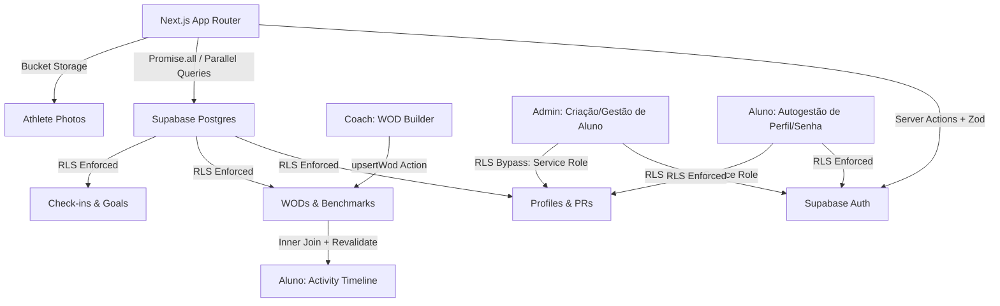

# 🏛️ COLISEU CLUBE V2

Bem-vindo à "Monolito de Ferro", a infraestrutura digital de elite do Coliseu. Este repositório centraliza o dashboard do aluno, gestão administrativa e as fundações de dados da plataforma.

---

## 📚 ÍNDICE DE DOCUMENTAÇÃO E PLAYBOOKS

A documentação segue o protocolo "Legacy Proof", garantindo manutenibilidade:

### 🏛️ Módulo Admin
- [PLAYBOOK: Admin Hub (Painel Geral)](docs/PLAYBOOKS/ADMIN_HUB.md) - KPIs, matrículas recentes e fluxo de acesso.
- [PLAYBOOK: WOD Engine (Builder de Treinos)](docs/PLAYBOOKS/ADMIN_WOD_ENGINE.md) - Builder split-screen, Benchmark Library e sincronia com timeline do aluno.
- [PLAYBOOK: Gestão de Alunos](docs/PLAYBOOKS/ADMIN_STUDENT_MANAGEMENT.md) - Matrícula, RLS Bypass, edição em Drawer e segurança de exclusão.
- [PLAYBOOK: Gestão de Turmas](docs/PLAYBOOKS/CLASSES_MANAGEMENT.md) - Grade semanal, Matrículas fixas e Monitoramento Live.
- [PLAYBOOK: Fechamento de Aula](docs/PLAYBOOKS/FECHAMENTO_AULA.md) - Fluxo de presenças e distribuição de XP (Gamificação).

### 🏃 Módulo Aluno
- [PLAYBOOK: Dashboard do Aluno](docs/PLAYBOOKS/STUDENT_DASHBOARD.md) - Guia operacional do App do Aluno.
- [PLAYBOOK: Motor de Gamificação](docs/PLAYBOOKS/GAMIFICATION_ENGINE.md) - Regras de XP, Níveis (L1-L5) e Validação.
- [PLAYBOOK: Avaliações Físicas](docs/PLAYBOOKS/AVALIACOES_FISICAS.md) - SOP de Biometria, Fotos e Radar de Saúde.
- [PLAYBOOK: Autenticação & Login](docs/PLAYBOOKS/AUTH-LOGIN.md) - Fluxo de acesso e operacional do carrossel.
- [PLAYBOOK: Estratégia de Ícones](docs/PLAYBOOKS/UI_ICON_STRATEGY.md) - Padrão de conformidade Lucide-React (Zero Font symbols).
- [PLAYBOOK: Identidade do Atleta](docs/PLAYBOOKS/USER_IDENTITY_SYSTEM.md) - Lógica de Nomes e Dual Badge.

### 📐 Arquitetura & Design
- [GUIA: Iron Monolith Architecture](docs/PLAYBOOKS/IRON_MONOLITH_GUIDE.md) - Filosofia visual, tokens CSS e estética brutalista.
- [ARCHITECTURE: Iron Engine](docs/ARCHITECTURE/ACTIVITY_ENGINE.md) - Engenharia de dados, gamificação (XP/PRs) e arquitetura Server/Client.
- [SQL SCHEMA: Contratos de Dados](docs/schema.sql) - Definição técnica das tabelas e RLS.

## 🛠️ ARQUITETURA DO SISTEMA

O projeto segue um padrão de engenharia focado em performance, isolamento de dados e interatividade em tempo real:

### Princípios Inegociáveis (A Doutrina do Código):
1. **Isolamento de Tenant (RLS):** Garantido por políticas granulares no banco de dados. Nunca cruzar dados sem bypass explícito (service_role).
2. **Design Brutalista (Iron Monolith):** Performance instantânea e zero carregamentos em branco (Skeleton Screens). Estética militar, alto contraste e recortes geométricos (clip-path).
3. **Segurança de Mutação:** Uso de Zod para todo payload processado por Server Actions.
4. **Resiliência de Estado:** Uso tático de Optimistic UI para feedbacks imediatos (Ex: seleção tática de treinos semanais).

---

## 🚀 ESTRUTURA DE DIRETÓRIOS

- src/app/: Camada de Roteamento Next.js (Dashboard do Aluno, Perfil, Autenticação).
- src/components/: Componentes modulares brutalistas, divididos por nicho (Progresso, Atleta, Layout).
- docs/: Motor de conhecimento. Contém os SOPs, Playbooks arquiteturais e esquemas do sistema.
- public/levels/: Ativos de marca oficiais para a subida de níveis Coliseu.

---
**Versão do Sistema:** 2.3.1 (Legacy Proof Audit & XP Integration)  
**Equipe:** Antigravity AI & Coliseu Engineering
