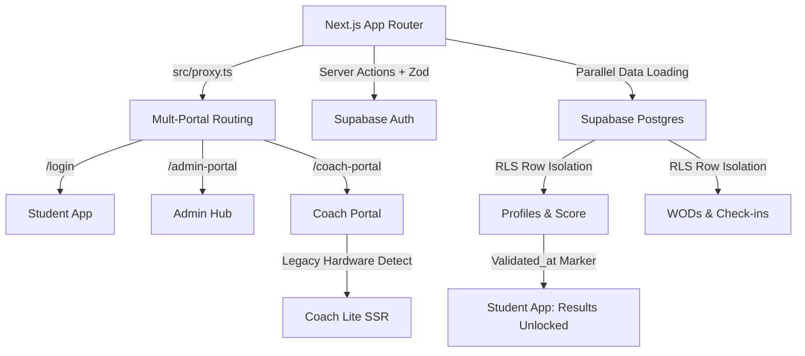

# 🏛️ COLISEU CLUBE V2

Bem-vindo à "Monolito de Ferro", a infraestrutura digital de elite do Coliseu. Este repositório centraliza o dashboard do aluno, o Portal do Coach e as fundações de dados da plataforma.

---

## 🚀 ESTRUTURA DO PROJETO

O Coliseu Clube V2 é construído sobre uma arquitetura de Monolito de Ferro, focada em performance extrema, isolamento de dados e estética Neo-Brutalista.

---

## 🛠️ ARQUITETURA DO SISTEMA

O projeto utiliza um stack moderno focado em performance extrema e isolamento de dados:

### Princípios de Engenharia:
1. **Isolamento de Dados (RLS):** Segurança inegociável. Dados de alunos nunca se cruzam sem autorização explícita.
2. **Estética Funcional (Neo-Brutalism):** Design de alto contraste (Nike/Adidas style), focado em ação e clareza visual.
3. **SSoT (Single Source of Truth):** Toda aula ou resultado depende do marcador `validated_at`. Nada é deletado, apenas invalidado ou inacessível.
4. **Resiliência UTC-3:** Operações de tempo centralizadas para garantir paridade entre fuso do servidor e do box.
5. **Progressive Enhancement:** Suporte a hardware legado via modo `/coach-lite` (100% SSR).

---

## 🚀 ESTRUTURA DE DIRETÓRIOS

- `src/app/(student)`: Experiência mobile do aluno (Fundo Branco/Neo-Brutalism).
- `src/app/(coach)`: Interface operacional para coaches no tatame. Inclui `/coach-lite`.
- `src/app/(admin)`: Painel de gestão estratégica e financeira.
- `docs/`: Sistema de conhecimento distribuído (Playbooks e SOPs), organizado por categoria.

  **🎓 Aluno & Identidade**
  - `docs/PLAYBOOKS/STUDENT_APP.md`: Guia mestre da experiência do aluno.
  - `docs/PLAYBOOKS/STUDENT_DASHBOARD.md`: Dashboard do aluno (WOD, check-in, atividades).
  - `docs/PLAYBOOKS/ATHLETE_IDENTITY_PROFILE.md`: Perfil do atleta, apelido, WhatsApp e sticky save.
  - `docs/PLAYBOOKS/coliseu-levels.md`: Sistema de Níveis Técnicos (L1–L5), SSoT e identidade visual.
  - `docs/PLAYBOOKS/POINTS_ENGINE.md`: Motor de pontuação e gamificação (Coliseu Pontos).
  - `docs/PLAYBOOKS/PONTUACAO.md`: Regras de negócio de pontuação detalhadas.
  - `docs/PLAYBOOKS/ACTIVITY_DASHBOARD.md`: Dashboard de atividades e histórico de treinos.
  - `docs/PLAYBOOKS/RESULTS_LOGGING.md`: Registro de resultados de WODs e PRs.
  - `docs/PLAYBOOKS/WOD_LEADERBOARD.md`: Motor de Ranking e Liga de Pontuação Semanal (Clube).
  - `docs/PLAYBOOKS/COMPARTILHAMENTO_ATIVIDADE.md`: Motor de compartilhamento de stickers de WOD.
  - `docs/PLAYBOOKS/ACCESS_MANAGEMENT.md`: Motor de Permissões Dinâmico e gestão de planos.

  **🏃 Módulo Running**
  - `docs/PLAYBOOKS/RUNNING_HUB.md`: Gestão estratégica de atletas, planilhas em massa, Engenharia de Treino V1.
  - `docs/PLAYBOOKS/RUNNING_SUPORTE.md`: Página de suporte (Compliance Strava).
  - `docs/PLAYBOOKS/STRAVA_INTEGRATION.md`: Webhooks, homologação e conformidade com o Strava API Program.

  **🏋️ Admin & Gestão**
  - `docs/PLAYBOOKS/COFRE_E_REAJUSTE.md`: Procedimentos do cofre, contratos blindados e reajustes granulares.
  - `docs/PLAYBOOKS/STONE_INTEGRATION.md`: Topologia e fluxo do Gateway Pagarme V5.
  - `docs/PLAYBOOKS/ADMIN_DASHBOARDS_OTE.md`: Painéis administrativos adaptativos e Roteamento Contextual (O.T.E.).
  - `docs/PLAYBOOKS/CONTRACTS_PLANS_MANAGEMENT.md`: Gestão de planos comerciais, regras de check-in e modelos de contrato (Rules Engine).
  - `docs/PLAYBOOKS/FISCAL_INTEGRATION.md`: Integração Fiscal e Emissão de NFS-e (Gateways e Webhooks).
  - `docs/PLAYBOOKS/COMPLIANCE_DOCUMENTS_MANAGEMENT.md`: Gestão de termos legais (Regimento Interno, LGPD) e questionário médico obrigatório (PAR-Q).
  - `docs/PLAYBOOKS/ADMIN_WOD_ENGINE.md`: Motor de criação e gestão de WODs.
  - `docs/PLAYBOOKS/ADMIN_STUDENT_MANAGEMENT.md`: Gestão de alunos pelo admin.
  - `docs/PLAYBOOKS/ADMIN_COACH_MANAGEMENT.md`: Gestão de coaches e substituições.
  - `docs/PLAYBOOKS/CLASSES_MANAGEMENT.md`: Gestão de turmas e grade de horários.
  - `docs/PLAYBOOKS/FECHAMENTO_AULA.md`: Procedimento de fechamento e validação de aulas.
  - `docs/PLAYBOOKS/gestao_turmas.md`: Fluxo detalhado de gestão de turmas.
  - `docs/PLAYBOOKS/registro_resultados.md`: Fluxo de registro de resultados via admin.
  - `docs/PLAYBOOKS/PRESENCA_FREQUENCIA_DASHBOARD.md`: Dashboard de Presença & Frequência (CRM).

  **🧑‍🏫 Coach**
  - `docs/PLAYBOOKS/COACH_PORTAL.md`: Portal do Coach — presença, chamada e fechamento.
  - `docs/PLAYBOOKS/COACH_LITE_LEGACY.md`: Guia para suporte a iPad 2/iOS 9 (Coach Lite SSR).

  **🔐 Segurança & Infraestrutura**
  - `docs/PLAYBOOKS/AUTH-LOGIN.md`: Fluxo de autenticação e login.
  - `docs/PLAYBOOKS/RECUPERACAO_SENHA.md`: Fluxo de recuperação de senha.
  - `docs/PLAYBOOKS/PRE_CADASTRO.md`: Fluxo de pré-cadastro e aprovação de leads.
  - `docs/PLAYBOOKS/EDGE_SECURITY_CRAWLER_MITIGATION.md`: Escudo Duplo (Cloudflare + Geoblocking).
  - `docs/PLAYBOOKS/ROUTING_ARCHITECTURE.md`: Arquitetura de roteamento multi-portal.
  - `docs/PLAYBOOKS/DATABASE_OPTIMIZATION_PLAYBOOK.md`: Otimizações e índices do banco de dados.

  **📱 PWA & Performance**
  - `docs/PLAYBOOKS/PWA_UPDATE_GUARD.md`: Versionamento e atualização de cache PWA.
  - `docs/PLAYBOOKS/PWA_HYBRID_SYNC.md`: Motor de sincronização híbrida PWA.
  - `docs/PLAYBOOKS/TIMEZONE_SSoT.md`: Protocolo de manipulação de datas (UTC-3 Anchor).

  **🎨 Design & UI**
  - `docs/PLAYBOOKS/IRON_MONOLITH_GUIDE.md`: Guia de estética Neo-Brutalist (Iron Monolith).
  - `docs/PLAYBOOKS/UI_ICON_STRATEGY.md`: Política de ícones SVG Nativos (Zero Font Symbols).
  - `docs/PLAYBOOKS/FEEDBACK_SYSTEM.md`: Sistema de feedback visual (toasts, modais, estados).
  - `docs/PLAYBOOKS/COLISEU_TV.md`: Playbook do Coliseu TV (Grade adaptativa de check-ins, WOD estruturado e auto-cura).

  **🏥 Avaliações**
  - `docs/PLAYBOOKS/AVALIACOES_FISICAS.md`: Motor de cálculos biométricos (Pollock 7) e Hub de Progresso.

---
---
**Versão: 5.0.0 (Junho/2026) - Desacoplamento de Rotas, Novo Menu e Módulo Loja**
**Status da Auditoria:** 🏛️ LEGACY PROOF (Protocolo 1.0.4) - CONCLUÍDA
**Equipe:** Antigravity AI & Coliseu Engineering Team
