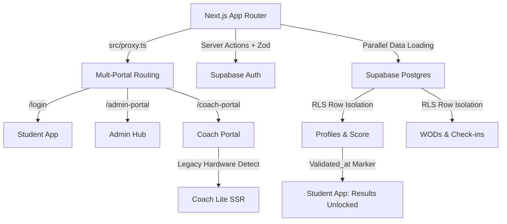

# 🏛️ COLISEU CLUBE V2

Bem-vindo à "Monolito de Ferro", a infraestrutura digital de elite do Coliseu. Este repositório centraliza o dashboard do aluno, o Portal do Coach e as fundações de dados da plataforma.

---

## 🚀 ESTRUTURA DO PROJETO

O Coliseu Clube V2 é construído sobre uma arquitetura de Monolito de Ferro, focada em performance extrema, isolamento de dados e estética Neo-Brutalista.

---

## 🛠️ ARQUITETURA DO SISTEMA

O projeto utiliza um stack moderno focado em performance extrema e isolamento de dados:

### Princípios de Engenharia:
1. **Isolamento de Dados (RLS):** Segurança inegociável. Dados de alunos nunca se cruzam sem autorização explícita.
2. **Estética Funcional (Neo-Brutalism):** Design de alto contraste (Nike/Adidas style), focado em ação e clareza visual.
3. **SSoT (Single Source of Truth):** Toda aula ou resultado depende do marcador `validated_at`. Nada é deletado, apenas invalidado ou inacessível.
4. **Resiliência UTC-3:** Operações de tempo centralizadas para garantir paridade entre fuso do servidor e do box.
5. **Progressive Enhancement:** Suporte a hardware legado via modo `/coach-lite` (100% SSR).

---

## 🚀 ESTRUTURA DE DIRETÓRIOS

- `src/app/(student)`: Experiência mobile do aluno (Fundo Branco/Neo-Brutalism).
- `src/app/(coach)`: Interface operacional para coaches no tatame. Inclui `/coach-lite`.
- `src/app/(admin)`: Painel de gestão estratégica e financeira.
- `docs/`: Sistema de conhecimento distribuído (Playbooks e SOPs).
  - `docs/PLAYBOOKS/ACCESS_MANAGEMENT.md`: Motor de Permissões Dinâmico e gestão de planos.
  - `docs/PLAYBOOKS/COACH_LITE_LEGACY.md`: Guia para suporte a iPad 2/iOS 9.
  - `docs/PLAYBOOKS/STUDENT_APP.md`: Guia mestre da experiência do aluno.
  - `docs/PLAYBOOKS/PWA_UPDATE_GUARD.md`: Procedimento de versionamento e atualização de cache.
  - `docs/PLAYBOOKS/RUNNING_HUB.md`: Gestão estratégica de atletas, gerador de planilhas em massa, Engenharia de Treino V1 (Multi-blocos/Zonas) e métricas de Pace.
  - `docs/PLAYBOOKS/AVALIACOES_FISICAS.md`: Motor de cálculos biométricos (Pollock 7), Self-Healing Engine e Hub de Progresso.
  - `docs/PLAYBOOKS/TIMEZONE_SSoT.md`: Protocolo inegociável de manipulação de datas e horários (UTC-3 Anchor).
  - `docs/PLAYBOOKS/STRAVA_INTEGRATION.md`: Webhooks, homologação e conformidade com o Strava API Program.
  - `docs/PLAYBOOKS/RUNNING_SUPORTE.md`: Playbook operacional da página obrigatória de suporte (Compliance Strava).
  - `docs/PLAYBOOKS/COMPARTILHAMENTO_ATIVIDADE.md`: Playbook do motor de compartilhamento de stickers de WOD (Estilo Strava).
  - `docs/PLAYBOOKS/EDGE_SECURITY_CRAWLER_MITIGATION.md`: Playbook da arquitetura de Escudo Duplo (Cloudflare + Geoblocking no Middleware).
  - `docs/PLAYBOOKS/PWA_HYBRID_SYNC.md`: Playbook do motor de sincronização híbrida PWA (Revalidação de Visibilidade e Toque).
  - `docs/PLAYBOOKS/UI_ICON_STRATEGY.md`: Procedimento Operacional Padrão de Ícones SVG Nativos (Zero Font Symbols).

---
---
**Versão: 4.2.1 (Maio/2026) - PWA Sincronização Híbrida Ready**  
**Status da Auditoria:** 🏛️ LEGACY PROOF (Protocolo 1.0.3) - CONCLUÍDA  
**Equipe:** Antigravity AI & Coliseu Engineering Team
