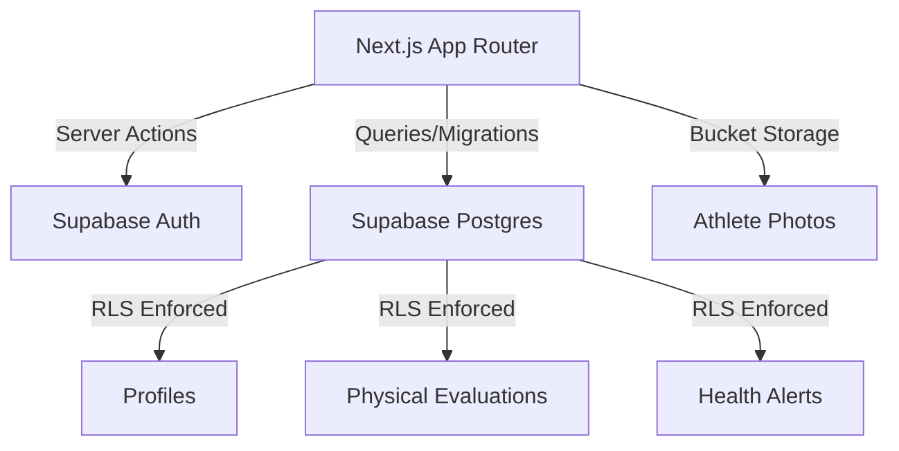

# 🏛️ COLISEU CLUBE V2

Bem-vindo à "Monolito de Ferro", a infraestrutura digital de elite do Coliseu. Este repositório centraliza o dashboard do aluno, gestão administrativa e as fundações de dados da plataforma.

---

## 🛠️ ARQUITETURA DO SISTEMA

O projeto Seguirmos um padrão de engenharia focado em performance e segurança. A documentação técnica detalhada (SOPs e Playbooks) é mantida em ambiente privado para segurança da infraestrutura.

O projeto é construído sobre o padrão-ouro de engenharia moderna:

### Princípios Inegociáveis:
1. **Isolamento de Tenant:** Garantido via RLS no banco de dados. Nunca cruzar dados de usuários sem bypass explícito (service_role).
2. **Design Brutalista:** Estética "Iron Monolith" com performance instantânea e zero carregamentos em branco (Skeletons/Suspense).
3. **Tipagem Estrita:** Uso de Zod em todas as camadas de entrada e saída.

---

## 🚀 ESTRUTURA DE DIRETÓRIOS

- `src/`: Código fonte Next.js (Dashboard do Aluno, Perfil, Treinos).
- `docs/`: Documentação técnica (SOPs, Playbooks, Schemas).
- `Design/`: Ativos de marca e ícones do Coliseu Levels.

---
**Versão do Sistema:** 2.0.2  
**Equipe:** Antigravity AI & Coliseu Engineering
