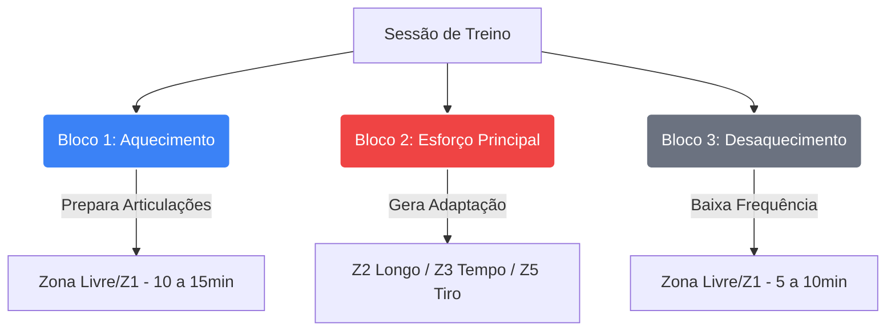

# 🏃‍♂️ Coliseu Running: Hub de Engenharia de Treino

Este diretório contém o "cérebro" e o Padrão Ouro (SOP - *Standard Operating Procedure*) da nossa assessoria de corrida. Documento gerido sob a rigorosa política de auditoria *Legacy Proof*.

Se você é um novo Coach assumindo a gestão, siga rigorosamente a trilha abaixo para garantir que a **Metodologia Coliseu** se mantenha blindada.

## 🗺️ O Seu Roteiro de Onboarding

### Passo 1: Domine o "Core System"
Antes de cadastrar qualquer treino, leia a base da engenharia:
👉 **[00-metodologia-core.md](./00-metodologia-core.md)**
- **Zonas Fisiológicas** (PSE).
- **Regra dos 10%** (Volume).

### Passo 2: Entenda a Matriz (O Oráculo)
👉 **[Planilha Metodologia Running.csv](./Planilha%20Metodologia%20Running.csv)**
O CSV dita a Meta Final de cada ID. *(Análise matemática em: [01-analise-matriz-pace.md](./01-analise-matriz-pace.md))*

### Passo 3: O Padrão de Geração (Data Entry)
Nós mapeamos **3 templates mestres** (Rascunhos Estruturais). Eles espelham exatamente os campos do Painel Admin:
- **1x/Semana (8 Semanas):** 👉 [Planilhas 1X/Planilha-ID1.md](./Planilhas%201X/Planilha-ID1.md)
- **2x/Semana (6 Semanas):** 👉 [Planilhas 2X/Planilha-ID16.md](./Planilhas%202X/Planilha-ID16.md)
- **3x/Semana (4 Semanas):** 👉 [Planilhas 3X/Planilha-ID31.md](./Planilhas%203X/Planilha-ID31.md)

---

## 📐 Arquitetura de Fluxo (Diagrama Multi-Blocos)

---

## 🛠️ Procedimento Operacional Padrão (SOP de Cadastro)

Ao receber a tarefa de preencher as semanas do **ID 4**, siga este checklist:
1. **Consulte o CSV:** Descubra a frequência, meta e pace alvo.
2. **Copie o Template:** Use o `ID1`, `ID16` ou `ID31` dependendo da frequência.
3. **Calcule as Zonas:** Aplique a matemática do `core.md`.
4. **Aplique a Progressão (10%):** Aumente o volume gradativamente e insira o *Deload* na penúltima semana.
5. **Cadastre no Painel:** Adicione na ordem (Aquecimento ➔ Esforço ➔ Desaquecimento).

---

## 🔌 Contratos Técnicos (SSoT & Compliance)

Conforme o protocolo `agente-protocolo-doc.md`, a metodologia Coliseu Running obedece aos seguintes contratos:

- **Single Source of Truth (SSoT):** A planilha `Planilha Metodologia Running.csv` é a ÚNICA fonte de verdade para Paces e Metas. Nenhuma Server Action ou UI pode sobrescrever essas metas matemáticas.
- **UTC Enforcement:** As durações (em semanas) das planilhas são agnósticas ao timezone do aluno, mas todas as datas de "início" processadas no App usam **12:00:00Z (Noon UTC)** para garantir paridade.
- **Privacidade e Isolamento:** Esta pasta (`/Site/Running/`) contém propriedade intelectual (IP) da Academia Coliseu. Em caso de abertura de código (Open Source), esta pasta deve ser incluída no `.gitignore`.

## 🧰 Troubleshooting Fisiológico (Self-Healing)

**O que fazer quando o ciclo do aluno quebra?**

- **Aluno doente/Faltou 1 semana:** O sistema é *Agnóstico a Datas*. O treino da semana 3 o espera intacto. Não avance para a semana 4. O aluno retoma de onde parou.
- **Aluno não consegue bater o Pace (Falha de Z5):** Se o aluno reportar no aplicativo um Esforço (PSE) de 10/10 na Z2, o Coach deve rebaixar o nível do aluno no painel Admin (Ex: Voltar do ID 17 para o ID 16).
- **Dores Crônicas (Canelite):** Substitua os blocos de Z5 e Z3 por "Caminhada Rápida" ou pause o acesso do aluno ao Hub (Running Status: Inativo) até a liberação da fisioterapia. O treino não expira.

*Protocolo Version: 1.0.3 (Legacy Proof)*
