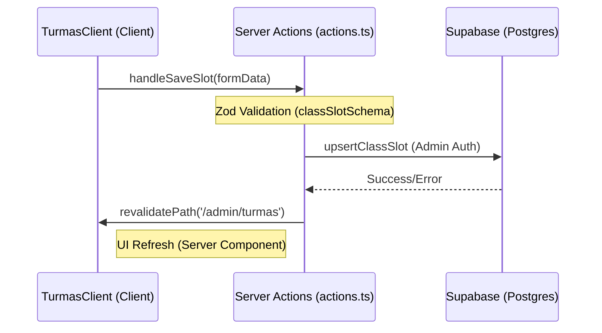

# Architecture: Turmas Module (Classes Management)

Este diretório contém a lógica de front-end e as ações de servidor para a gestão da grade de horários e matrículas do Coliseu.

---

## 🏗️ Fluxo de Dados (Data Flow)

O módulo utiliza um padrão de **Single Source of Truth** vindo do banco de dados, com revalidação de cache via Next.js `revalidatePath`.

## 🛠️ Componentes Principais

- **`page.tsx`**: Server component que busca a grade inicial, ocupação e WODs.
- **`TurmasClient.tsx`**: Gerenciador de estado da UI. Controla abas, modais e feedback visual.
- **`actions.ts`**: Camada de persistência. Contém a lógica de segurança e permissões.

---

## 🔒 Segurança

1. **Role Check**: Todas as ações verificam se o usuário logado possui e-mail administrativo ou role `admin`/`reception`.
2. **Service Role**: Para permitir que administradores editem a grade (que possui RLS restritivo para usuários comuns), utilizamos o `createAdminClient` com a `SUPABASE_SERVICE_ROLE_KEY`.

---
**Protocolo:** Agente Protocolo Doc 1.0.1
